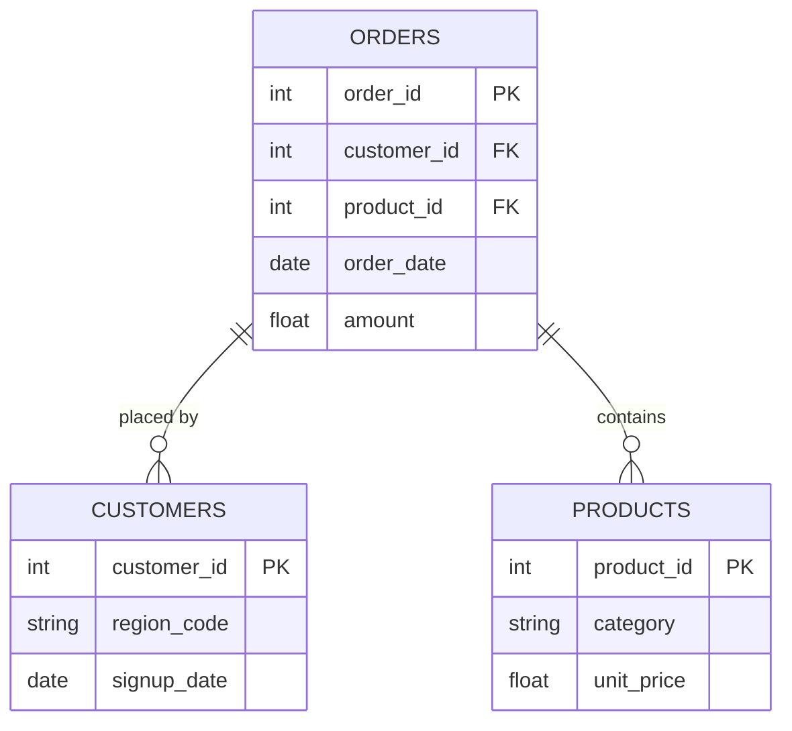

# Jumia Smartphone Market Analysis | Python & Power BI
> *One sentence. What did you analyze, build, or solve - and why does it matter?*

---

## ⚙️ Project Type Flags
> *Check what applies. This helps reviewers and collaborators understand the nature of the work at a glance. Delete this block before publishing.*

- Web Scraping
- Exploratory Data Analysis
-  Data Cleaning / Wrangling
-  Business Intelligence    
-  Dashboard / Data Visualization
-  Data Analysis
-  Data Modeling
---

## Table of Contents
1. [Project Overview](#1-project-overview)
2. [Business Problem & Objectives](#2-Business-Problem--Objectives)
3. [Project Scope & Tools](#3-project-scope--tools)
4. [Repository Structure](#4-repository-structure)
5. [Data Workflow](#5-data-workflow)
6. [Data Model & Schema](#6-data-model--schema)
7. [ERD - Entity Relationship Diagram](#7-erd--entity-relationship-diagram) *(SQL projects)*
8. [Analysis & Metrics](#8-analysis--metrics)
9. [Key Insights](#9-key-insights)
10. [Recommendations](#10-recommendations)
11. [Assumptions & Limitations](#11-assumptions--limitations)
12. [Future Enhancements](#12-future-enhancements)
13. [Deliverables](#13-deliverables)
14. [Author](#14-author)

---

## 1. Project Overview

<!--
"Jumia has thousands of smartphone listings with different brands, prices, specifications, discounts, and customer ratings, making it difficult to see clear patterns in the market. I wanted to understand which brands and product specifications were most common and how factors such as price, RAM, storage, discounts, ratings, and reviews varied across the listings. I scraped and cleaned 2,800+ smartphone records using Python, Pandas, and Regex, then used Power BI to analyze and visualize the data. The project turned the raw listings into a structured analysis that made the main product, pricing, and specification patterns easier to understand."

  WHAT TO AVOID:
  "This project analyzes sales data to find trends and insights."
  (Too vague. Could describe 10,000 projects. Describes none of them.)
-->

**Context:** I wanted to understand the smartphone market on Jumia and turn real-world product listings into useful information about the products available to customers.

**Problem Statement:** With thousands of listings containing different brands, prices, specifications, discounts, ratings, and reviews, it was difficult to identify clear patterns in the market. I wanted to find out which brands and smartphone specifications were most common and how pricing and other product factors varied.

**Approach:** I scraped 2,800+ Jumia smartphone listings using Python, then cleaned and transformed the data with Pandas and Regex. I used Power BI to model, analyze, and visualize the data across key areas such as brands, pricing, RAM, storage, discounts, ratings, and reviews.

**Outcome:** I produced a structured dataset and Power BI analysis/dashboard that made product, pricing, and specification patterns easier to identify and understand.

---

## 2. Objectives

<!--
  Write objectives that are specific enough to succeed or fail.
  Use action-oriented verbs: Identify, Determine, Quantify, Build, Evaluate.

  WHAT GOOD LOOKS LIKE:
  ✅ "Determine whether customer churn rate correlates with support ticket volume."
  ✅ "Identify the top three revenue-driving product categories across all regions."
  ✅ "Build a reproducible pipeline that ingests and cleans daily sales exports."

  WHAT TO AVOID:
  ❌ "Explore the data."
  ❌ "Gain insights."
  ❌ "Understand trends."
  (These can't fail - which means they can't succeed either.)
-->

- **Primary Objective:** Analyze 2,800+ Jumia smartphone listings to understand product, pricing, and market patterns.
- **Secondary Objective 1:** Identify the most common smartphone brands, RAM, storage, operating systems, and other product specifications.
- **Secondary Objective 2:** 
- **Secondary Objective 3:** Examine pricing, discounts, ratings, and reviews to uncover useful patterns and present the findings through a Power BI dashboard.

> 💡 *Every analysis decision in this project traces back to one of these objectives.*

---

### Scope

<!--
  WHAT GOOD LOOKS LIKE:
  In Scope: "Transaction-level data for Regions A–E, Jan 2023–Jun 2024.
             Analysis covers revenue, return rates, and product category performance."
  Out of Scope: "Customer demographics and marketing spend data were excluded -
                 demographic data was incomplete for two regions, and marketing
                 data sits in a separate system outside this engagement."

  WHAT TO AVOID:
  ❌ Leaving Out of Scope blank. This is the section that protects your credibility.
     If you don't define the fence, reviewers assume you missed things.
-->

| Dimension | Details |
|-----------|---------|
| **In Scope** | [Jumia smartphone listings covering product names, brands, models, prices, discounts, ratings, reviews, RAM, storage, operating systems, colors, and screen sizes.] |
| **Out of Scope** | [Actual sales, revenue, customer demographics, purchase behavior, and competitor websites, because these data were not available in the collected Jumia listings.] |
| **Granularity** | [Product-listing level — each row represents an individual smartphone listing/product record.] |

### Tools & Technologies

<!--
  List only what you actually used on this project.
  This is not your skills section - it's the project's technical context.
-->

| Category | Tool(s) Used |
|----------|-------------|
| Data Storage | CSV / Pandas DataFrame |
| Data Processing | Python, Pandas, NumPy, Regular Expressions (Regex) |
| Analysis | Python, Pandas, Exploratory Data Analysis (EDA) |
| Visualization |Matplotlib, Power BI |
| Version Control | Git, GitHub |
| Documentation | Jupyter Notebook, GitHub README |

---

## 4. Repository Structure

```
[project-root]/
│
├── data/
│   ├── raw/                  # Original, unmodified source data - never edited
│   ├── processed/            # Cleaned and transformed data
│   └── external/             # Reference data, lookup tables, third-party files
│
├── notebooks/                # Jupyter, R Markdown, or Colab notebooks
│
├── scripts/                  # Reusable .py, .R, or .sh processing files
│
├── queries/                  # SQL files (retain this folder for SQL-heavy projects)
│   ├── exploratory/          # Ad-hoc or investigative queries
│   ├── transformations/      # Cleaning and reshaping logic
│   └── final/                # Production-ready or presentation queries
│
├── reports/                  # Final outputs: PDFs, slide decks, Word docs
│
├── visuals/                  # Exported charts, dashboard screenshots, ERD diagrams
│
├── docs/                     # Data dictionaries, schema notes, reference material
│
├── project_metadata.yml      # Machine-readable metadata (optional)
└── README.md                 # You are here
```

> ⚠️ *Delete folders you didn't use. An empty folder is worse than no folder.*
> SQL-heavy projects: keep `queries/`. Analysis-only projects: keep `notebooks/`. Both? Keep both.

---

## 5. Data Workflow

<!--
  Show how data moved through your project - from source to output.
  Every transformation decision should be traceable here.

  WHAT GOOD LOOKS LIKE:
  1. Source: "Monthly CSV exports pulled from the internal POS system.
              Five files, one per region, covering Jan 2023–Jun 2024."
  2. Ingestion: "Loaded into Python using pandas. Files concatenated into
                 a single dataframe (approx. 340,000 rows)."
  3. Cleaning: "Removed 1.2% of rows with null transaction IDs.
                Standardised date formats across regional files.
                Resolved product category naming inconsistencies (3 variants → 1)."
  4. Transformation: "Created a returns_rate field at product-category level.
                      Aggregated to weekly and regional grain for trend analysis."
  5. Analysis: "Descriptive statistics, regional comparison, return rate
                segmentation by product category."
  6. Output: "Summary report (PDF), annotated notebook, processed CSV."

  WHAT TO AVOID:
  ❌ "Data was cleaned and analysed." (No chain. No decisions. No trust.)
-->

```
[Data Source(s)]
      ↓
[Ingestion / Collection Method]
      ↓
[Cleaning & Transformation]
      ↓
[Analysis / Modelling / Querying]
      ↓
[Output / Visualisation / Reporting]
```

1. **Source:** Jumia smartphone product listings collected from the website, with 2,800+ product records containing fields such as product name, price, brand, discount, rating, reviews, RAM, storage, OS, color,
2. **Ingestion:** The listings were collected through Python web scraping and loaded into a Pandas DataFrame for inspection and processing.
3. **Cleaning:** I identified and handled duplicate records, missing values, inconsistent product names, price formats, and unstructured specification information. Price values and other relevant fields were standardized where possible.
4. **Transformation:** I used Pandas and Regex to extract structured attributes from product names, creating fields such as brand, model, RAM, storage, OS, color, and screen size.
5. **Analysis:** I performed exploratory data analysis using Python/Pandas and used Power BI to analyze and visualize patterns in brands, pricing, RAM, storage, discounts, ratings, and reviews.
6. **Output:** The project produced a cleaned, structured dataset and Power BI dashboard/visual analysis showing smartphone product and pricing patterns and supporting market-focused insights.

---

## 6. Data Model & Schema

<!--
  Define your fields so that someone reading your analysis can follow along
  without digging through your code.

  WHAT GOOD LOOKS LIKE (one row example):
  | transaction_id | string | Unique identifier per sales transaction | TXN-00482 |
  | return_flag    | boolean | Whether the transaction included a return | TRUE |
  | region_code    | string | Two-letter identifier for store region | "NE" |

  WHAT TO AVOID:
  ❌ Skipping this section because "the field names are self-explanatory."
     They're not. Not to a reviewer. Not to you in six months.

  📌 FOR SQL PROJECTS: If you have multiple tables, create one block per table.
     Describe join keys and relationships here. Your ERD (Section 7) will
     visualise what this section describes in text.

  📌 FOR NON-SQL PROJECTS: Describe the shape of your dataset informally
     if a formal schema doesn't apply. Even one paragraph is more helpful than nothing.
-->

### Dataset / Table

[View Table](./reports/FINAL_UPDATED_MODELS_CLEANED.csv)

| Field Name | Data Type | Description | Example Value |
|------------|-----------|-------------|---------------|
| `Name` | [string | Full smartphone product listing name collected from Jumia. | Nokia 5310, 2.4" 16MB & 8MB RAM... |
| `Price` | int | Listed selling price of the smartphone in Nigerian Naira (₦). | 56000 |
| `Image` | string | URL linking to the product image. | https://ng.jumia.is/... |
| `Link` | string | URL linking to the original Jumia product listing. | https://www.jumia.com.ng/... |
| `Discount` | float | Discount percentage applied to the listed product. | 25.0 |
| `rating` | float | Customer rating associated with the product listing. | 3.5 |
| `reviews` | int | Number of customer reviews associated with the product. | 22 |
| `price_category` | String | Category assigned to the smartphone based on its price level. | Low |
| `value_sfloatcore` | flaot | Calculated score used to evaluate the product's relative value based on the available analysis variables. | 0.003485 |
| `phone_model` | string | Standardized smartphone brand/model extracted from the product listing. | nokia 5310 |
| `ram` | string | RAM capacity extracted from the product information. | 4GB |
| `storage` | string | Internal storage capacity extracted from the product information. | 64GB |
| `color` | string | Smartphone color stated in the product listing. | Black |


> **Row count (approx.):** 1761
> **Date range:** [01] – 1761
> **Key join / relationship:** [`smartphone` → `product_variant`]

*Add additional table blocks as needed for multi-table projects.*

---

## 7. ERD - Entity Relationship Diagram
### *(Primarily for SQL Projects - remove this section if not applicable)*

<!--
  An ERD shows how your tables connect to each other visually.
  It is the fastest way for a reviewer to understand the data structure
  of a SQL project without reading every query.

  HOW TO INCLUDE YOUR ERD:
  Option A - Image embed (most common):
    Export your ERD from dbdiagram.io, DBeaver, Lucidchart, or similar.
    Save to /visuals/erd.png and reference it below.

  Option B - dbdiagram.io code block (version-controllable):
    Paste your schema definition code directly in the fenced block below.
    Anyone can paste it into dbdiagram.io to regenerate the visual.

  Option C - Mermaid diagram (renders natively in GitHub):
    Use the mermaid code block syntax below.
    GitHub will render this as a diagram automatically.

  PICK ONE. Don't use all three. Delete the options you don't use.
-->

### Option A - Embedded Image

*[Brief caption: e.g., "Three-table schema - orders, customers, and products joined on shared IDs."]*

---

### Option B - dbdiagram.io Schema Definition
```
Table orders {
  order_id    int     [pk]
  customer_id int     [ref: > customers.customer_id]
  product_id  int     [ref: > products.product_id]
  order_date  date
  amount      float
}

Table customers {
  customer_id int  [pk]
  region_code string
  signup_date date
}

Table products {
  product_id   int    [pk]
  category     string
  unit_price   float
}
```
*Paste this into [dbdiagram.io](https://dbdiagram.io) to view the visual.*

---

### Option C - Mermaid Diagram *(renders on GitHub)*


---

**Table Relationships Summary:**

| Relationship | Join Key | Type |
|-------------|----------|------|
| `orders` → `customers` | `customer_id` | Many-to-One |
| `orders` → `products` | `product_id` | Many-to-One |
| [Add rows as needed] | | |

---

## 8. Analysis & Metrics

<!--
  Explain what you measured and how - before you share what you found.

  WHAT GOOD LOOKS LIKE:
  Metric: "Customer Return Rate"
  Definition: "Number of transactions flagged as returns divided by total
               transactions, calculated at product-category and regional grain."
  Why It Matters: "Return rate - not sales volume - was hypothesised to
                  explain regional revenue gaps. This metric tests that hypothesis."

  WHAT TO AVOID:
  ❌ Defining a metric only in code: SUM(returns) / COUNT(transaction_id)
     That's an implementation. Write the plain-language definition here.
     Both belong in your project - the definition in the README,
     the implementation in the code.
-->

### Analytical Approach

The analysis followed an exploratory data analysis (EDA) approach. I first examined and cleaned the 2,800+ Jumia smartphone listings, then transformed unstructured product information into usable fields such as brand, model, RAM, storage, OS, color, and screen size. I explored product and pricing patterns by comparing brands, specifications, discounts, ratings, and reviews, and then used Power BI to present the findings in an interactive format. The main goal was to understand the characteristics and pricing patterns of smartphones listed on Jumia rather than build or validate a predictive model.

## Dashboards Overview 
Click [here](https://app.powerbi.com/groups/me/reports/e3cfa1f8-bdfe-495f-9415-f8dbe9ee2bf6/3c1c74029e636d6b5130?experience=power-bi)

| Executive Dashboard                      | Brand Dashboard                               | Product Dashboard                     |
|------------------------------------------|-----------------------------------------------|---------------------------------------|
|       |                |          |


### Key Metrics Defined

| Metric | Plain-Language Definition | Why It Matters |
|--------|--------------------------|----------------|
| `Average price, Discount, Rating, Review` | The average listed price, Discount, Review and Rating of smartphones in the dataset. | Helps understand the typical fields level and compare fields across brands and specifications. |
| `Count Products` | The number of smartphone listings in a selected group. | Helps compare the presence of brands and product specifications within the dataset. |
| `Credibility Score` | Credibility Score measures how trustworthy a smartphone’s rating is by balancing its actual rating with the overall average rating based on the number of reviews. | Which smartphones have ratings that are genuinely credible, and which high ratings may be unreliable because they are based on too few reviews? |

### Methods Used

- Descriptive statistics: examined price, discount, rating, reviews, and product counts.
- Data distribution analysis: explored the distribution of smartphone prices and specifications.
- Brand segmentation: compared smartphone listings across different brands.
- Specification analysis: compared RAM, storage, operating system, color, and screen-size patterns.
- Pricing analysis: examined price ranges and differences across brands and specifications.
- Discount analysis: explored discount patterns across smartphone listings.
- Customer engagement analysis: examined ratings and review counts.
- Exploratory visual analysis: used Power BI to communicate patterns and comparisons through interactive dashboards.

---

## 9. Key Insights

<!--
  Findings + implications. Not just what happened - what it means.

  WHAT GOOD LOOKS LIKE:
  ✅ "Return rates, not sales volume, explain Region A's underperformance.
      Region A's return rate on home goods was 34% - more than double the
      company average. Revenue was not lost at the point of sale; it was
      lost post-sale through refunds. This points to a fulfilment or
      product quality issue specific to that region, not a demand problem."

  WHAT TO AVOID:
  ❌ "Region A had lower revenue than other regions in Q4."
     (That's an observation. It describes what happened.
      An insight says what it means and where to look next.)

  Aim for 3–6 insights. Quality over quantity.
-->

**Insight 1: Samsung Had the Strongest Marketplace Presence**
Samsung had the highest number of listings in the dataset, with 607 products, followed by Apple (283) and Xiaomi (154). This suggests Samsung had the strongest product representation among the sampled Jumia smartphone listings.

**Insight 2: 128GB and 256GB Were the Dominant Storage Options**
Storage capacity was concentrated around 128GB (681 products) and 256GB (565 products), together accounting for a large share of the listings. This indicates that mid-to-high storage configurations were the most commonly available options in the sampled market.

**Insight 3: Smartphone Prices Varied Significantly Across Brands**
The dashboard showed substantial differences in average prices between brands. Premium brands such as Apple, Google, and OnePlus appeared among the higher-priced brands, while several other brands had considerably lower average listing prices. This highlights clear price positioning differences across the market.

**Insight 4: High Ratings Did Not Always Mean High Customer Engagement**
The product-level analysis showed that some highly rated phones had relatively few reviews, while other products had much higher review volumes. This led to the use of a Credibility Score that considers both rating and review volume, providing a more balanced way to evaluate product ratings.

---

## 10. Recommendations

<!--
  Action-oriented. Addressed to a real audience.
  Tied explicitly to the insight that supports each one.

  WHAT GOOD LOOKS LIKE:
  Priority: High
  Recommendation: "Conduct a fulfilment audit for home goods deliveries
                   in Region A - specifically investigating whether returns
                   correlate with a particular warehouse, carrier, or SKU batch."
  Based On: Insight 1 - return rate anomaly in Region A
  Owner: Operations / Supply Chain team

  WHAT TO AVOID:
  ❌ "Improve the return rate."
     (Not actionable. Doesn't say who, how, or where to start.)
  ❌ "Further analysis is needed."
     (This is a placeholder, not a recommendation.)
-->

| Priority | Recommendation | Based On | Suggested Owner |
|----------|---------------|----------|-----------------|
| High | Prioritize monitoring and merchandising of high-demand smartphone brands, particularly Samsung, Apple, and Xiaomi, while ensuring popular configurations remain well represented. | Samsung had the highest listing presence, with 607 products, followed by Apple and Xiaomi. | Category / Marketplace Manager |
| Medium | Review pricing and product positioning across brands to identify opportunities for more competitive pricing, especially where premium and lower-priced brands serve different customer segments. | Significant differences were observed in average prices across brands. | Pricing / Commercial Team |
| Medium | Focus product analysis on the most common storage configurations, particularly 128GB and 256GB, when evaluating assortment and availability. | 128GB and 256GB were the dominant storage capacities in the dataset. | Category / Merchandising Team |
| Low | Use the Credibility Score alongside raw ratings when comparing products and consider collecting additional customer and sales data for a stronger product-performance assessment. | Some products had high ratings but relatively different review volumes. | Data / BI & Product Team |

---

## 11. Assumptions & Limitations

<!--
  WHAT GOOD LOOKS LIKE:
  Assumption: "Transaction records were assumed to be complete for all five regions.
               No validation was performed against source system record counts."
  Limitation: "The analysis cannot distinguish between returns initiated by
               the customer vs. returns initiated by the business (e.g., recalls).
               If business-initiated returns are concentrated in Region A, the
               return rate finding may reflect a policy decision, not a quality issue."

  WHAT TO AVOID:
  ❌ Leaving this section blank or writing "None known."
     Every project has limitations. Documenting them is a sign of
     analytical maturity - not a confession of failure.
-->

### Assumptions
- The listed price, discount, rating, and review values were treated as representative of the product information displayed on Jumia at the time of data collection.
- Product specifications such as RAM, storage, OS, color, and screen size were interpreted from the available product listing information and standardized during data preparation.
- Each collected product listing was treated as an individual product record for analysis.
- The Credibility Score was used as an analytical metric to provide additional context around product ratings and review volume; it should not be interpreted as an official Jumia rating measure.
- The analysis focuses on marketplace listing patterns, rather than actual product sales or customer purchasing behavior.

### Limitations
- The dataset represents Jumia listings collected during the scraping exercise, so it may not represent the entire Nigerian smartphone market.
- Product availability, prices, discounts, ratings, and review counts can change over time, meaning the results represent a snapshot of the marketplace rather than a permanent market position.
- The dataset does not contain verified sales volume, revenue, profit, inventory levels, customer demographics, or conversion rates, so conclusions about actual commercial performance cannot be made.
- Some product specifications were extracted from unstructured product names, meaning inconsistent naming conventions or missing information may affect the accuracy of extracted attributes.
- The analysis does not establish causal relationships. For example, a higher rating or lower price cannot be assumed to cause higher sales without sales or customer-behavior data.
- The analysis is based on Jumia's marketplace listings, so comparisons with other Nigerian e-commerce platforms were outside the scope of this project.
- A more rigorous version could incorporate historical price tracking, sales data, customer behavior, seller information, and competitor marketplace data to provide deeper market and commercial insights.

> *The goal here is pre-emptive Q&A. What would a thoughtful skeptic push back on? Document the answer here, before they ask.*

---

## 12. Future Enhancements

<!--
  WHAT GOOD LOOKS LIKE:
  ✅ "Automate the monthly data pull from the POS export folder using
      a scheduled Python script, replacing the current manual process."
  ✅ "Expand the return rate analysis to include carrier-level data,
      which was unavailable in this dataset but exists in the logistics system."

  WHAT TO AVOID:
  ❌ "Add a machine learning model."
     (Vague, and disconnected from the actual findings of this project.)
  ❌ Listing aspirational features that don't follow logically from the work.
-->

- [ ] [Enhancement 1 - specific and traceable to a real gap in this project]
- [ ] [Enhancement 2]
- [ ] [Enhancement 3]
- [ ] [Enhancement 4]

---

## 13. Deliverables

| Deliverable | Description | Location |
|-------------|-------------|----------|
| [Name] | [What it contains] | [`/path/to/file`] |
| [Name] | [What it contains] | [`/path/to/file`] |
| [Name] | [What it contains] | [`/path/to/file`] |

---

## 14. Author

**[Your Name]**
[Your role or title - current or target]

- 🔗 [LinkedIn URL]
- 💼 [Portfolio or GitHub profile URL]
- 📧 [Email - optional]

---

*Last updated: [Month YYYY]*
*If this template helped you, consider starring the repository.*
